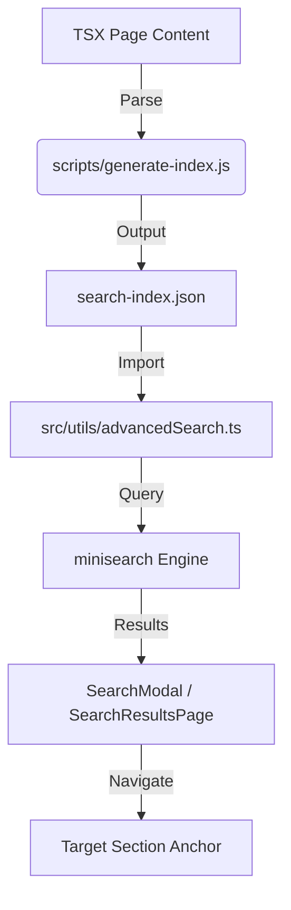

# Advanced Search Architecture

## Component Diagram



## Data Flow

1.  **Index Generation**: A Node script scans `src/pages/` and uses regex/parsing to find `<section id="...">` blocks.
2.  **Indexing**: Each section becomes a "document" in MiniSearch.
3.  **Search**: When a user types "deploy", MiniSearch finds all sections containing "deploy", even if they aren't the main page title.
4.  **Navigation**: The result `url` includes the hash (e.g., `/openshift#deployments`), allowing the router to jump straight to the content.

## Section Parser Logic (Example)

```javascript
// Pseudocode for indexer
const content = fs.readFileSync('OpenShiftGuidelinePage.tsx', 'utf8');
const sections = content.match(/<section id="([^"]+)"[^>]*>([\s\S]*?)<\/section>/g);

sections.forEach(s => {
  const id = s.match(/id="([^"]+)"/)[1];
  const title = s.match(/<h2[^>]*>([^<]+)<\/h2>/)?.[1];
  const body = stripJsx(s); // Remove tags
  
  index.push({
    id: `openshift-${id}`,
    url: `/openshift#${id}`,
    title: title || 'OpenShift Section',
    content: body
  });
});
```
