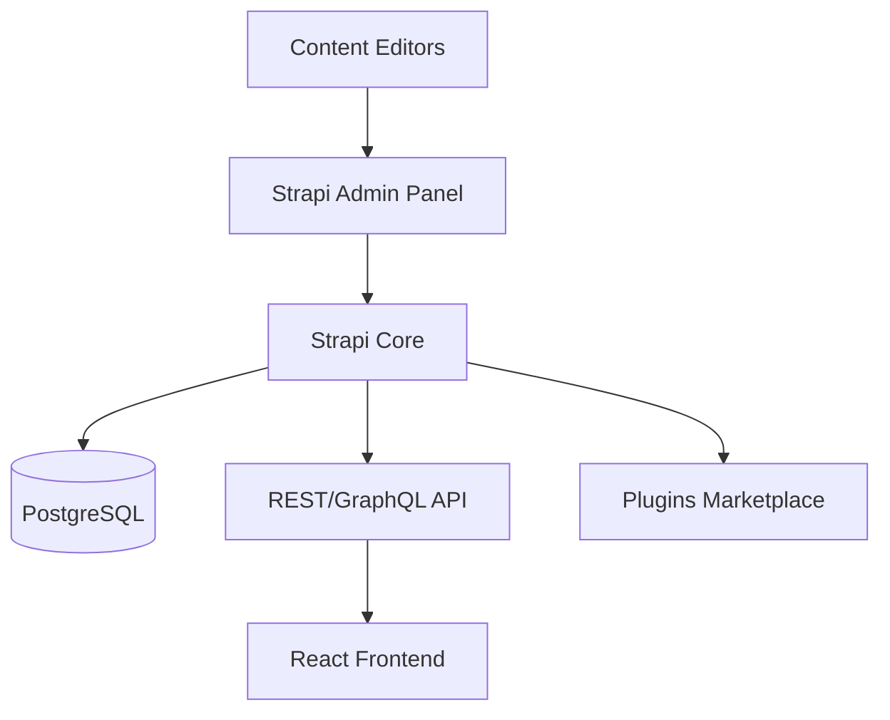
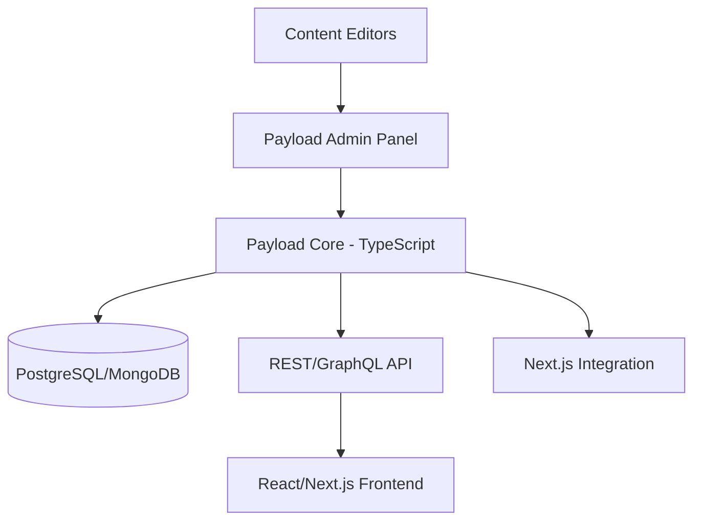
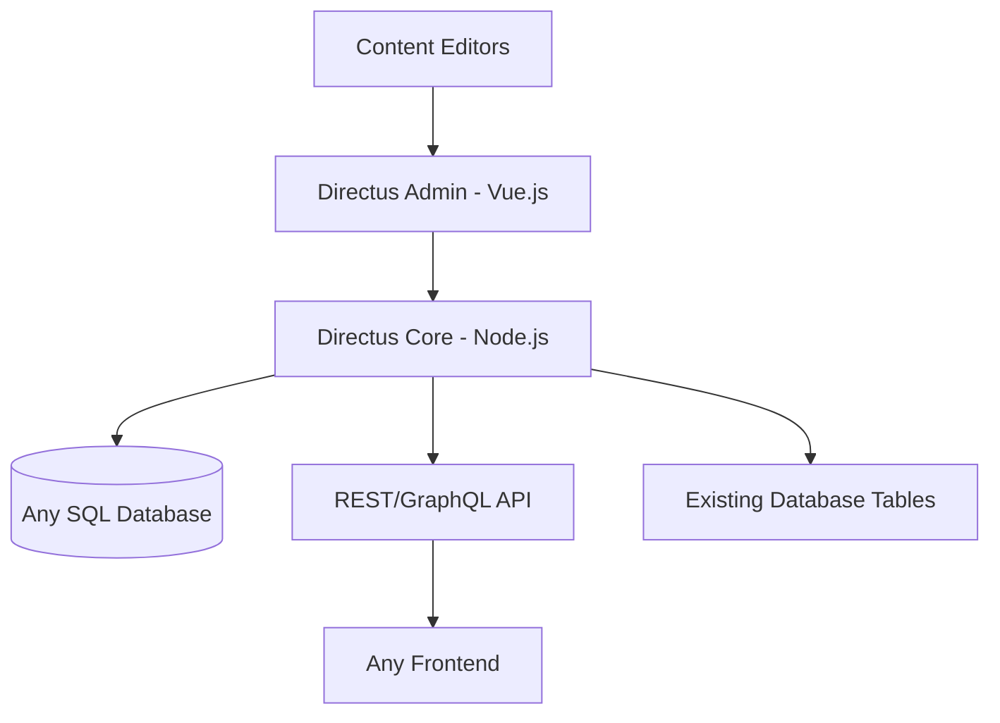

# CMS Platform Comparison

## Overview

This document compares three leading open-source headless CMS platforms that support PostgreSQL, Docker deployment, and integrate well with React/TypeScript applications.

---

## Platform Comparison Matrix

| Feature | Strapi | Payload CMS | Directus |
|---------|--------|-------------|----------|
| **License** | MIT (Free) | MIT (Free) | GPL v3 (Free) |
| **PostgreSQL Support** | ✅ Native | ✅ Native | ✅ Native |
| **Docker Support** | ✅ Official Images | ✅ Official Images | ✅ Official Images |
| **TypeScript** | ⚠️ Partial (v5 better) | ✅ First-class | ⚠️ Partial |
| **React Admin UI** | ✅ React-based | ✅ React-based | Vue.js-based |
| **GraphQL** | ✅ Plugin | ✅ Built-in | ✅ Built-in |
| **REST API** | ✅ Built-in | ✅ Built-in | ✅ Built-in |
| **Approach** | Plugin-based | Code-first | Database-first |
| **Community** | ⭐⭐⭐⭐⭐ Largest | ⭐⭐⭐ Growing | ⭐⭐⭐⭐ Established |
| **Learning Curve** | ⭐⭐⭐ Moderate | ⭐⭐ Developer-friendly | ⭐⭐⭐ Moderate |

---

## Detailed Platform Analysis

### 1. Strapi

```
Website: https://strapi.io
GitHub Stars: 60k+
Latest Version: v5.x
```

#### Architecture


#### Strengths
- ✅ **Largest ecosystem** with extensive plugin marketplace
- ✅ **Comprehensive documentation** and tutorials
- ✅ **Visual content-type builder** for non-developers
- ✅ **Established platform** with enterprise support options
- ✅ **Multi-database support** (PostgreSQL, MySQL, SQLite, MongoDB)
- ✅ **Internationalization** built-in (i18n plugin)

#### Weaknesses
- ⚠️ TypeScript support improving but not first-class
- ⚠️ Plugin-based approach can lead to dependency complexity
- ⚠️ Admin panel customization requires learning internal APIs
- ⚠️ Breaking changes between major versions historically

#### Best For
- Teams wanting a mature, well-documented solution
- Projects requiring extensive plugin ecosystem
- Organizations with mixed technical/non-technical content teams

#### Sample Docker Compose
```yaml
version: '3'
services:
  strapi:
    image: strapi/strapi:latest
    environment:
      DATABASE_CLIENT: postgres
      DATABASE_HOST: postgres
      DATABASE_PORT: 5432
      DATABASE_NAME: strapi
      DATABASE_USERNAME: strapi
      DATABASE_PASSWORD: strapi
    ports:
      - '1337:1337'
    depends_on:
      - postgres

  postgres:
    image: postgres:15
    environment:
      POSTGRES_DB: strapi
      POSTGRES_USER: strapi
      POSTGRES_PASSWORD: strapi
    volumes:
      - postgres-data:/var/lib/postgresql/data

volumes:
  postgres-data:
```

---

### 2. Payload CMS

```
Website: https://payloadcms.com
GitHub Stars: 25k+
Latest Version: v3.x
```

#### Architecture


#### Strengths
- ✅ **100% TypeScript** with full type safety
- ✅ **Code-first configuration** (config as code)
- ✅ **Next.js native integration** (built on Next.js)
- ✅ **Excellent developer experience** with hot reloading
- ✅ **Highly customizable** admin UI components
- ✅ **Built-in authentication** and access control
- ✅ **Real-time preview** capabilities

#### Weaknesses
- ⚠️ Smaller community compared to Strapi
- ⚠️ Requires more developer involvement for setup
- ⚠️ Less non-technical user-friendly initially
- ⚠️ Fewer third-party plugins available

#### Best For
- TypeScript-heavy projects
- Developer teams who prefer code-first configuration
- Projects already using or planning to use Next.js
- Teams wanting maximum customization control

#### Sample Configuration
```typescript
// payload.config.ts
import { buildConfig } from 'payload/config';
import { postgresAdapter } from '@payloadcms/db-postgres';

export default buildConfig({
  admin: {
    user: 'users',
  },
  db: postgresAdapter({
    pool: {
      connectionString: process.env.DATABASE_URL,
    },
  }),
  collections: [
    {
      slug: 'guidelines',
      fields: [
        { name: 'title', type: 'text', required: true },
        { name: 'slug', type: 'text', unique: true },
        { name: 'content', type: 'richText' },
        { name: 'category', type: 'select', options: [
          { label: 'Development', value: 'development' },
          { label: 'Infrastructure', value: 'infrastructure' },
          { label: 'Architecture', value: 'architecture' },
        ]},
        { name: 'publishedAt', type: 'date' },
      ],
    },
  ],
});
```

---

### 3. Directus

```
Website: https://directus.io
GitHub Stars: 28k+
Latest Version: v10.x
```

#### Architecture


#### Strengths
- ✅ **Database-first approach** - wraps existing databases
- ✅ **Works with existing schema** - ideal for legacy databases
- ✅ **Unlimited roles** in free version
- ✅ **Advanced permissions** with field-level access control
- ✅ **WebSocket support** for real-time updates
- ✅ **Multi-database support** (PostgreSQL, MySQL, Oracle, SQL Server, SQLite)
- ✅ **Beautiful admin interface** (Vue.js-based)

#### Weaknesses
- ⚠️ Admin UI built with Vue.js (not React)
- ⚠️ Steeper learning curve for customization
- ⚠️ Less TypeScript integration than Payload
- ⚠️ Requires understanding of SQL schema design

#### Best For
- Projects with existing databases
- Organizations needing advanced permission systems
- Teams comfortable with Vue.js for admin customization
- Enterprise scenarios requiring multiple databases

#### Sample Docker Compose
```yaml
version: '3'
services:
  directus:
    image: directus/directus:latest
    ports:
      - 8055:8055
    environment:
      KEY: 'your-random-key'
      SECRET: 'your-random-secret'
      DB_CLIENT: 'pg'
      DB_HOST: 'postgres'
      DB_PORT: '5432'
      DB_DATABASE: 'directus'
      DB_USER: 'directus'
      DB_PASSWORD: 'directus'
      ADMIN_EMAIL: 'admin@example.com'
      ADMIN_PASSWORD: 'admin'
    depends_on:
      - postgres

  postgres:
    image: postgres:15
    environment:
      POSTGRES_DB: directus
      POSTGRES_USER: directus
      POSTGRES_PASSWORD: directus
    volumes:
      - postgres-data:/var/lib/postgresql/data

volumes:
  postgres-data:
```

---

## Feature Deep Dive

### Content Modeling

| CMS | Approach | Rich Text Editor | Media Management |
|-----|----------|------------------|------------------|
| Strapi | Visual Builder + JSON | Customizable (Blocks, Markdown) | Built-in with providers |
| Payload | TypeScript Config | Lexical (Modern) | Built-in with adapters |
| Directus | Database Schema | WYSIWYG | Built-in with transformations |

### Developer Experience

| CMS | CLI Tools | Hot Reload | Type Generation |
|-----|-----------|------------|-----------------|
| Strapi | `npx create-strapi-app` | ✅ Yes | Plugin available |
| Payload | `npx create-payload-app` | ✅ Yes | ✅ Native TypeScript |
| Directus | `npx create-directus-project` | ⚠️ Partial | SDK available |

### Authentication & Access Control

| CMS | Auth Methods | Role System | Field-Level Permissions |
|-----|--------------|-------------|------------------------|
| Strapi | JWT, Providers | Admin + Custom | ✅ Yes |
| Payload | JWT, Custom | Flexible Policies | ✅ Yes |
| Directus | JWT, SSO, LDAP | Unlimited Roles | ✅ Yes (Advanced) |

---

## Recommendation for This Project

### 🏆 Recommended: **Payload CMS**

Given the project's characteristics:
- ✅ Existing React/TypeScript stack
- ✅ Developer-focused team
- ✅ Need for high customization
- ✅ Modern deployment requirements (OpenShift/Docker)

**Payload CMS** is the ideal choice because:

1. **Perfect TypeScript Integration**: Matches existing codebase philosophy
2. **Code-First Approach**: Aligns with developer workflow
3. **Next.js Ready**: Easy integration with modern React patterns
4. **PostgreSQL Native**: Full support for target database
5. **Docker-Friendly**: Clean containerization support
6. **Customizable Admin**: React-based admin panel can be themed to match existing application

### Alternative: **Strapi**

If the team prefers:
- More extensive plugin ecosystem
- Larger community support
- Visual content modeling tools

### Alternative: **Directus**

If the project requires:
- Integration with existing databases
- Advanced permission systems
- Database-first approach

---

## Decision Matrix

Score each factor (1-5) based on project priorities:

| Factor | Weight | Strapi | Payload | Directus |
|--------|--------|--------|---------|----------|
| TypeScript Support | 5 | 3 | 5 | 3 |
| PostgreSQL Integration | 4 | 4 | 5 | 5 |
| Docker Deployment | 4 | 5 | 5 | 5 |
| React Ecosystem | 5 | 4 | 5 | 3 |
| Learning Curve | 3 | 4 | 3 | 3 |
| Community Size | 3 | 5 | 3 | 4 |
| Admin Customization | 4 | 4 | 5 | 4 |
| Documentation | 3 | 5 | 4 | 4 |
| **Weighted Total** | | **108** | **119** | **101** |

**Winner: Payload CMS** (119 points)

---

## Next Steps

1. Review [UI/UX Best Practices](./03-ui-ux-best-practices.md) for admin interface design
2. Examine [Architecture Design](./04-architecture-design.md) for Payload CMS deployment
3. Follow [Implementation Roadmap](./05-implementation-roadmap.md) to begin development
