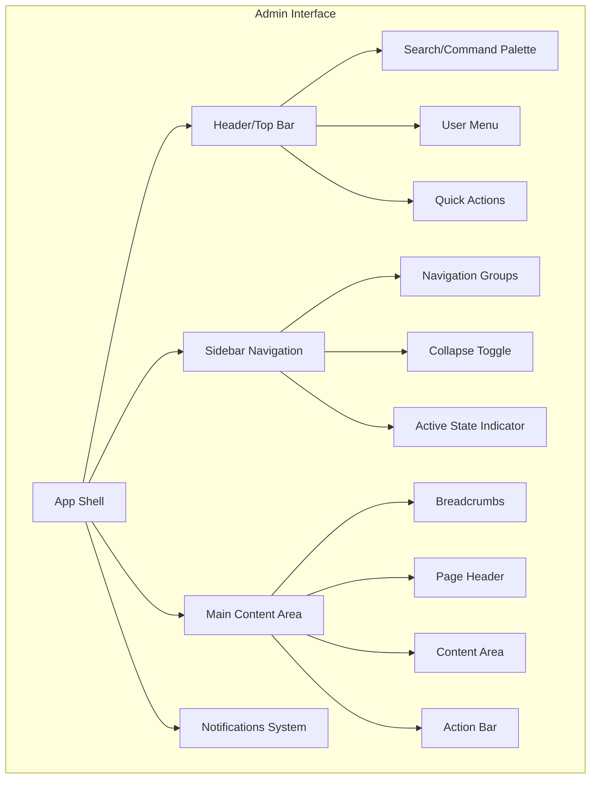

# UI/UX Best Practices for CMS

## Overview

This document outlines UI/UX best practices and design patterns for building a world-class Content Management System admin interface. These guidelines are based on research from leading CMS platforms, modern dashboard design principles, and accessibility standards.

---

## Core Design Principles

### 1. Clarity and Simplicity

> **"Don't make users think"** — Steve Krug

The CMS interface should be immediately understandable, even for first-time users.

| Principle | Implementation |
|-----------|----------------|
| Minimize cognitive load | Use familiar patterns, consistent layouts |
| Progressive disclosure | Show advanced options only when needed |
| Clear visual hierarchy | Important elements should stand out |
| Whitespace utilization | Give content room to breathe |

### 2. Efficiency for Power Users

Content editors spend hours in the CMS daily. Optimize for speed and efficiency.

```
⌨️ Keyboard shortcuts (Cmd/Ctrl + S to save)
🔍 Quick search and command palette (Cmd/Ctrl + K)
📝 Autosave drafts
↩️ Undo/Redo support
📋 Bulk operations
```

### 3. Accessibility (WCAG 2.1 AA)

The CMS must be usable by everyone, including users with disabilities.

| Area | Requirements |
|------|-------------|
| Color Contrast | Minimum 4.5:1 for normal text |
| Keyboard Navigation | All functions accessible via keyboard |
| Screen Readers | Proper ARIA labels and landmarks |
| Focus Indicators | Visible focus states on all interactive elements |
| Error Messages | Clear, descriptive error text |

---

## Admin Dashboard Layout

### Recommended Structure

```
┌─────────────────────────────────────────────────────────────────┐
│  🔍 Search                              🔔 Notifications  👤     │  ← Top Bar (56-64px)
├──────────────┬──────────────────────────────────────────────────┤
│              │                                                  │
│  📊 Dashboard│  Main Content Area                               │
│  📄 Content  │  ─────────────────────────────────────────────── │
│    Guidelines│  Breadcrumbs / Page Title                        │
│    Categories│                                                  │
│    Media     │  ┌───────────────────────────────────────────┐  │
│  👥 Users    │  │                                           │  │
│  ⚙️ Settings │  │       Primary Content / Data Grid         │  │
│              │  │                                           │  │
│              │  │                                           │  │
│              │  └───────────────────────────────────────────┘  │
│              │                                                  │
│              │  Pagination / Actions                            │
├──────────────┴──────────────────────────────────────────────────┤
│  Footer / Status Bar (optional)                                 │
└─────────────────────────────────────────────────────────────────┘

Sidebar: 240-300px expanded, 48-64px collapsed
```

### Component Breakdown



---

## Sidebar Navigation Best Practices

### Design Guidelines

| Aspect | Recommendation |
|--------|----------------|
| **Width** | 240-300px expanded, 48-64px collapsed |
| **Position** | Fixed left side |
| **Scrolling** | Independent scroll for long menus |
| **Active State** | Clear highlight with background color or border |
| **Icons** | 24x24px, always paired with text when expanded |

### Navigation Structure Example

```
├── 📊 Dashboard                    ← Quick overview
├── 📄 Content                       ← Expandable group
│   ├── Guidelines                  ← Primary content type
│   ├── Categories                  ← Taxonomy
│   ├── Tags                        ← Metadata
│   └── Media Library               ← Assets
├── 🏗️ Structure                     ← Content modeling
│   ├── Content Types
│   └── Components
├── 👥 Users & Permissions           ← User management
│   ├── Users
│   └── Roles
└── ⚙️ Settings                      ← Configuration
    ├── General
    ├── API Tokens
    └── Webhooks
```

### Interaction Patterns

1. **Expandable Sections**
   ```css
   /* Smooth accordion animation */
   .nav-section {
     max-height: 0;
     overflow: hidden;
     transition: max-height 0.3s ease-out;
   }
   .nav-section.expanded {
     max-height: 500px;
   }
   ```

2. **Active State Indication**
   ```css
   .nav-item.active {
     background: rgba(59, 130, 246, 0.1);
     border-left: 3px solid #3b82f6;
     color: #3b82f6;
   }
   ```

3. **Hover Feedback**
   ```css
   .nav-item:hover {
     background: rgba(0, 0, 0, 0.05);
     transition: background 0.15s ease;
   }
   ```

---

## Content Editor Interface

### Rich Text Editor Design

The content editor is the heart of the CMS. It should feel as natural as using a word processor.

#### Toolbar Design

```
┌────────────────────────────────────────────────────────────────────┐
│ B  I  U  S  │ H1 H2 H3 │ • ─ 1. │ "" </> │ 🔗 📷 📹 │ ⋮ More │
└────────────────────────────────────────────────────────────────────┘
  Text Format   Headings   Lists    Blocks   Media       Extended
```

#### Best Practices

| Feature | Implementation |
|---------|----------------|
| Floating Toolbar | Appears near selected text |
| Slash Commands | Type `/` to insert blocks |
| Drag & Drop | Reorder content blocks |
| Preview Mode | Toggle between edit and preview |
| Markdown Shortcuts | `**bold**`, `# heading`, etc. |

#### Block-Based Editor Pattern

```typescript
// Modern block-based content structure
interface ContentBlock {
  id: string;
  type: 'paragraph' | 'heading' | 'code' | 'image' | 'callout';
  data: Record<string, unknown>;
  children?: ContentBlock[];
}

// Example content blocks
const blocks: ContentBlock[] = [
  {
    id: '1',
    type: 'heading',
    data: { level: 1, text: 'Getting Started with Java' }
  },
  {
    id: '2',
    type: 'paragraph',
    data: { text: 'This guide covers best practices...' }
  },
  {
    id: '3',
    type: 'code',
    data: { language: 'java', code: 'public class Main {}' }
  }
];
```

---

## Data Tables and Lists

### Content List View

```
┌─────────────────────────────────────────────────────────────────────────┐
│  Guidelines                                    [+ Create New] [⬇ Export]│
├─────────────────────────────────────────────────────────────────────────┤
│  🔍 Search guidelines...    │ Status: All ▼ │ Category: All ▼ │ Clear  │
├─────────────────────────────────────────────────────────────────────────┤
│  □  Title                    │ Category      │ Status    │ Updated     │
├─────────────────────────────────────────────────────────────────────────┤
│  □  Java Developer Guide     │ Development   │ ● Published │ 2 hours ago│  → Row actions on hover
│  □  Python Best Practices    │ Development   │ ● Published │ Yesterday │
│  □  OpenShift Deployment     │ Infrastructure│ ○ Draft    │ Jan 15     │
│  □  Clean Architecture       │ Architecture  │ ● Published │ Jan 10     │
├─────────────────────────────────────────────────────────────────────────┤
│  ← 1 2 3 ... 10 →                            Showing 1-10 of 95 items   │
└─────────────────────────────────────────────────────────────────────────┘
```

### Table Design Guidelines

| Feature | Description |
|---------|-------------|
| Sortable Columns | Click headers to sort |
| Filterable | Quick filters for common queries |
| Searchable | Full-text search with highlighting |
| Bulk Actions | Select multiple items for batch operations |
| Inline Actions | Edit/Delete on row hover |
| Empty States | Helpful message when no data |

### Empty State Example

```
┌─────────────────────────────────────────────┐
│                                             │
│           📄                                │
│                                             │
│     No guidelines found                     │
│                                             │
│  Create your first guideline to get started │
│                                             │
│         [+ Create Guideline]                │
│                                             │
└─────────────────────────────────────────────┘
```

---

## Forms and Input Design

### Form Layout Best Practices

```
┌─────────────────────────────────────────────────────────────────┐
│  Create Guideline                                               │
├─────────────────────────────────────────────────────────────────┤
│                                                                 │
│  Title *                                                        │
│  ┌─────────────────────────────────────────────────────────┐   │
│  │ Java Developer Guideline                                 │   │
│  └─────────────────────────────────────────────────────────┘   │
│  A clear, descriptive title for the guideline                   │
│                                                                 │
│  Slug *                                    [Generate from title]│
│  ┌─────────────────────────────────────────────────────────┐   │
│  │ java-developer-guideline                                 │   │
│  └─────────────────────────────────────────────────────────┘   │
│  URL: /guidelines/java-developer-guideline                      │
│                                                                 │
│  Category *                           Status                    │
│  ┌────────────────────────┐          ┌────────────────────┐    │
│  │ Development        ▼  │          │ ○ Draft            │    │
│  └────────────────────────┘          │ ● Published        │    │
│                                      │ ○ Archived         │    │
│                                      └────────────────────┘    │
│                                                                 │
├─────────────────────────────────────────────────────────────────┤
│  [Cancel]                              [Save Draft] [Publish]   │
└─────────────────────────────────────────────────────────────────┘
```

### Input Validation

```typescript
// Real-time validation feedback
interface ValidationState {
  status: 'idle' | 'valid' | 'invalid' | 'validating';
  message?: string;
}

// Visual states
const inputStates = {
  idle: 'border-gray-300',
  valid: 'border-green-500 focus:ring-green-200',
  invalid: 'border-red-500 focus:ring-red-200',
  validating: 'border-blue-300 animate-pulse',
};
```

### Validation Message Patterns

| Type | Icon | Color | Example |
|------|------|-------|---------|
| Error | ❌ | Red | "Title is required" |
| Warning | ⚠️ | Yellow | "Title is very long" |
| Success | ✓ | Green | "Slug is available" |
| Info | ℹ️ | Blue | "Max 200 characters" |

---

## Notifications and Feedback

### Toast Notifications

```
Success:
┌──────────────────────────────────────┐
│  ✓  Guideline published successfully │ ✕
└──────────────────────────────────────┘

Error:
┌──────────────────────────────────────┐
│  ✕  Failed to save. Try again.       │ ✕
│  [Retry]                             │
└──────────────────────────────────────┘

Loading:
┌──────────────────────────────────────┐
│  ⟳  Publishing guideline...          │
└──────────────────────────────────────┘
```

### Confirmation Dialogs

```
┌─────────────────────────────────────────────────┐
│  ⚠️ Delete Guideline                           │
├─────────────────────────────────────────────────┤
│                                                 │
│  Are you sure you want to delete               │
│  "Java Developer Guideline"?                    │
│                                                 │
│  This action cannot be undone.                  │
│                                                 │
├─────────────────────────────────────────────────┤
│  [Cancel]                   [Delete Guideline]  │
│                              ↑ Destructive red  │
└─────────────────────────────────────────────────┘
```

---

## Dark Mode Design

### Color Token System

```css
:root {
  /* Light mode */
  --bg-primary: #ffffff;
  --bg-secondary: #f9fafb;
  --bg-tertiary: #f3f4f6;
  --text-primary: #111827;
  --text-secondary: #6b7280;
  --border-color: #e5e7eb;
  --accent-color: #3b82f6;
}

[data-theme="dark"] {
  /* Dark mode */
  --bg-primary: #1f2937;
  --bg-secondary: #111827;
  --bg-tertiary: #374151;
  --text-primary: #f9fafb;
  --text-secondary: #9ca3af;
  --border-color: #374151;
  --accent-color: #60a5fa;
}
```

### Dark Mode Contrast Requirements

| Element | Light Mode | Dark Mode | Contrast |
|---------|------------|-----------|----------|
| Primary Text | #111827 | #f9fafb | 21:1 / 18:1 |
| Secondary Text | #6b7280 | #9ca3af | 7:1 / 5:1 |
| Links | #3b82f6 | #60a5fa | 4.5:1 / 5:1 |
| Borders | #e5e7eb | #374151 | 3:1 / 3:1 |

---

## Mobile Responsiveness

### Breakpoint Strategy

```css
/* Mobile first approach */
.sidebar {
  display: none; /* Hidden on mobile */
}

/* Tablet */
@media (min-width: 768px) {
  .sidebar {
    display: block;
    width: 64px; /* Collapsed */
  }
}

/* Desktop */
@media (min-width: 1024px) {
  .sidebar {
    width: 280px; /* Expanded */
  }
}
```

### Mobile Navigation Pattern

```
Mobile (< 768px):            Tablet (768-1024px):        Desktop (> 1024px):
┌──────────────────┐         ┌───┬──────────────┐       ┌─────────┬────────────┐
│ ☰ Dashboard   👤 │         │📊 │              │       │ 📊 Dash │            │
├──────────────────┤         │📄 │  Content     │       │ 📄 Cont │  Content   │
│                  │         │👥 │              │       │   ├─ G  │            │
│    Content       │         │⚙️ │              │       │   ├─ C  │            │
│                  │         └───┴──────────────┘       │   └─ M  │            │
│                  │                                    │ 👥 User │            │
└──────────────────┘                                    └─────────┴────────────┘
  Bottom nav or                 Icons only               Full sidebar
  hamburger menu
```

---

## Microinteractions and Animations

### Animation Guidelines

| Interaction | Duration | Easing |
|-------------|----------|--------|
| Button Hover | 150ms | ease |
| Dropdown Open | 200ms | ease-out |
| Modal Appear | 250ms | ease-out |
| Page Transition | 300ms | ease-in-out |
| Toast Slide In | 300ms | cubic-bezier |

### Examples

```css
/* Button hover */
.btn {
  transition: all 0.15s ease;
}
.btn:hover {
  transform: translateY(-1px);
  box-shadow: 0 4px 12px rgba(0, 0, 0, 0.1);
}

/* Card hover */
.card {
  transition: transform 0.2s ease, box-shadow 0.2s ease;
}
.card:hover {
  transform: translateY(-2px);
  box-shadow: 0 8px 24px rgba(0, 0, 0, 0.12);
}

/* Loading spinner */
@keyframes spin {
  to { transform: rotate(360deg); }
}
.spinner {
  animation: spin 1s linear infinite;
}
```

---

## Command Palette (Quick Actions)

A modern addition to CMS interfaces, the command palette provides keyboard-driven navigation.

```
┌─────────────────────────────────────────────────────────────────┐
│  🔍 Type a command or search...                          ⌘K    │
├─────────────────────────────────────────────────────────────────┤
│  Suggested                                                      │
│  ─────────────────────────────────────────────────────────────  │
│  ▸ Create new guideline                               ⌘N       │
│    Create new category                                ⌘⇧N      │
│                                                                 │
│  Recent                                                         │
│  ─────────────────────────────────────────────────────────────  │
│    📄 Java Developer Guideline                                  │
│    📄 Python Best Practices                                     │
│                                                                 │
│  Navigation                                                     │
│  ─────────────────────────────────────────────────────────────  │
│    Go to Dashboard                                    ⌘D        │
│    Go to Settings                                     ⌘,        │
│                                                                 │
└─────────────────────────────────────────────────────────────────┘
```

---

## Summary Checklist

### Essential UI/UX Elements

- [ ] Responsive sidebar navigation (expandable/collapsible)
- [ ] Command palette for quick actions
- [ ] WYSIWYG/Block-based rich text editor
- [ ] Data tables with sort, filter, search
- [ ] Clear form validation and feedback
- [ ] Toast notifications for system messages
- [ ] Dark mode support
- [ ] Mobile-responsive design
- [ ] Keyboard navigation support
- [ ] Loading states and progress indicators
- [ ] Empty states with calls to action
- [ ] Breadcrumb navigation
- [ ] Undo/Redo support

### Accessibility Checklist

- [ ] WCAG 2.1 AA compliance
- [ ] Color contrast ratios (4.5:1 minimum)
- [ ] Focus indicators on all interactive elements
- [ ] ARIA labels for screen readers
- [ ] Skip links for keyboard users
- [ ] Reduced motion option
- [ ] Error messages associated with inputs

---

## Next Steps

1. Examine [Architecture Design](./04-architecture-design.md) for technical implementation
2. Follow [Implementation Roadmap](./05-implementation-roadmap.md) to begin development
