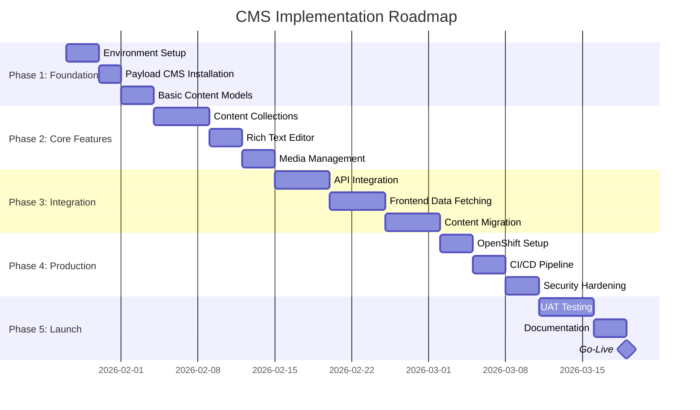

# Implementation Roadmap

## Overview

This document provides a phased implementation plan for building the CMS for the Developer Guideline application. The plan is designed for iterative delivery with clear milestones.

---

## Timeline Overview



**Estimated Total Duration: 8-10 weeks**

---

## Phase 1: Foundation Setup (Week 1-2)

### Goals
- Set up local development environment
- Install and configure Payload CMS
- Create basic project structure

### Tasks

#### 1.1 Environment Setup
- [ ] Create Docker Compose configuration
- [ ] Set up PostgreSQL database container
- [ ] Set up Redis cache container
- [ ] Set up MinIO for local S3 storage
- [ ] Configure environment variables

```bash
# Create project structure
mkdir -p developer-guideline/cms/{src/{collections,blocks,access,globals},k8s}
cd developer-guideline/cms
npm init -y
```

#### 1.2 Payload CMS Installation
- [ ] Install Payload CMS dependencies
- [ ] Configure TypeScript
- [ ] Set up PostgreSQL adapter
- [ ] Create initial payload.config.ts

```bash
# Install dependencies
npm install payload @payloadcms/db-postgres @payloadcms/richtext-lexical
npm install @payloadcms/bundler-webpack @payloadcms/storage-s3
npm install express dotenv
npm install -D typescript @types/node @types/express ts-node nodemon
```

#### 1.3 Basic Configuration
- [ ] Configure database connection
- [ ] Set up admin authentication
- [ ] Configure media storage adapter
- [ ] Create development scripts

```typescript
// payload.config.ts - Basic setup
import { buildConfig } from 'payload/config';
import { postgresAdapter } from '@payloadcms/db-postgres';
import { lexicalEditor } from '@payloadcms/richtext-lexical';
import { s3Storage } from '@payloadcms/storage-s3';

export default buildConfig({
  serverURL: process.env.PAYLOAD_PUBLIC_SERVER_URL || 'http://localhost:3001',
  admin: {
    user: 'users',
  },
  editor: lexicalEditor({}),
  db: postgresAdapter({
    pool: { connectionString: process.env.DATABASE_URL },
  }),
  plugins: [
    s3Storage({
      collections: { media: true },
      bucket: process.env.S3_BUCKET,
      config: {
        credentials: {
          accessKeyId: process.env.S3_ACCESS_KEY,
          secretAccessKey: process.env.S3_SECRET_KEY,
        },
        endpoint: process.env.S3_ENDPOINT,
        forcePathStyle: true,
      },
    }),
  ],
  collections: [/* Added in Phase 2 */],
});
```

### Deliverables
- ✅ Working Docker Compose environment
- ✅ Payload CMS running locally
- ✅ Admin panel accessible at http://localhost:3001/admin

---

## Phase 2: Core CMS Features (Week 3-4)

### Goals
- Define content models for guidelines
- Configure rich text editor
- Set up media management

### Tasks

#### 2.1 Content Collections

```typescript
// src/collections/Users.ts
import { CollectionConfig } from 'payload/types';

export const Users: CollectionConfig = {
  slug: 'users',
  auth: true,
  admin: {
    useAsTitle: 'email',
  },
  fields: [
    { name: 'name', type: 'text', required: true },
    {
      name: 'role',
      type: 'select',
      options: [
        { label: 'Admin', value: 'admin' },
        { label: 'Editor', value: 'editor' },
        { label: 'Viewer', value: 'viewer' },
      ],
      defaultValue: 'viewer',
    },
  ],
};
```

```typescript
// src/collections/Categories.ts
import { CollectionConfig } from 'payload/types';

export const Categories: CollectionConfig = {
  slug: 'categories',
  admin: {
    useAsTitle: 'name',
  },
  fields: [
    { name: 'name', type: 'text', required: true },
    { name: 'slug', type: 'text', unique: true, required: true },
    { name: 'description', type: 'textarea' },
    { name: 'icon', type: 'text' },
    { name: 'sortOrder', type: 'number', defaultValue: 0 },
  ],
};
```

```typescript
// src/collections/Guidelines.ts
import { CollectionConfig } from 'payload/types';

export const Guidelines: CollectionConfig = {
  slug: 'guidelines',
  admin: {
    useAsTitle: 'title',
    defaultColumns: ['title', 'category', 'status', 'updatedAt'],
  },
  versions: {
    drafts: true,
  },
  fields: [
    { name: 'title', type: 'text', required: true },
    {
      name: 'slug',
      type: 'text',
      unique: true,
      required: true,
      admin: {
        position: 'sidebar',
      },
    },
    {
      name: 'category',
      type: 'relationship',
      relationTo: 'categories',
      required: true,
    },
    {
      name: 'status',
      type: 'select',
      options: [
        { label: 'Draft', value: 'draft' },
        { label: 'Published', value: 'published' },
        { label: 'Archived', value: 'archived' },
      ],
      defaultValue: 'draft',
      admin: { position: 'sidebar' },
    },
    { name: 'summary', type: 'textarea' },
    {
      name: 'content',
      type: 'richText',
      required: true,
    },
    {
      name: 'sections',
      type: 'array',
      fields: [
        { name: 'title', type: 'text', required: true },
        { name: 'anchor', type: 'text', required: true },
        { name: 'content', type: 'richText' },
      ],
    },
    {
      name: 'meta',
      type: 'group',
      fields: [
        { name: 'keywords', type: 'text' },
        { name: 'readTime', type: 'number' },
      ],
      admin: { position: 'sidebar' },
    },
    { name: 'publishedAt', type: 'date', admin: { position: 'sidebar' } },
  ],
  hooks: {
    beforeChange: [
      ({ data }) => {
        // Auto-generate slug from title
        if (data.title && !data.slug) {
          data.slug = data.title
            .toLowerCase()
            .replace(/[^a-z0-9]+/g, '-')
            .replace(/^-|-$/g, '');
        }
        return data;
      },
    ],
  },
};
```

#### 2.2 Rich Text Editor Configuration

```typescript
// src/blocks/CodeBlock.ts
import { Block } from 'payload/types';

export const CodeBlock: Block = {
  slug: 'code',
  labels: { singular: 'Code Block', plural: 'Code Blocks' },
  fields: [
    {
      name: 'language',
      type: 'select',
      options: [
        { label: 'TypeScript', value: 'typescript' },
        { label: 'JavaScript', value: 'javascript' },
        { label: 'Java', value: 'java' },
        { label: 'Python', value: 'python' },
        { label: 'C#', value: 'csharp' },
        { label: 'YAML', value: 'yaml' },
        { label: 'Bash', value: 'bash' },
        { label: 'SQL', value: 'sql' },
      ],
      defaultValue: 'typescript',
    },
    { name: 'filename', type: 'text' },
    { name: 'code', type: 'code', required: true },
  ],
};
```

```typescript
// src/blocks/CalloutBlock.ts
import { Block } from 'payload/types';

export const CalloutBlock: Block = {
  slug: 'callout',
  labels: { singular: 'Callout', plural: 'Callouts' },
  fields: [
    {
      name: 'type',
      type: 'select',
      options: [
        { label: 'Note', value: 'note' },
        { label: 'Tip', value: 'tip' },
        { label: 'Important', value: 'important' },
        { label: 'Warning', value: 'warning' },
        { label: 'Caution', value: 'caution' },
      ],
      defaultValue: 'note',
    },
    { name: 'title', type: 'text' },
    { name: 'content', type: 'richText', required: true },
  ],
};
```

#### 2.3 Media Management

```typescript
// src/collections/Media.ts
import { CollectionConfig } from 'payload/types';

export const Media: CollectionConfig = {
  slug: 'media',
  admin: {
    useAsTitle: 'filename',
  },
  upload: {
    staticURL: '/media',
    staticDir: 'media',
    imageSizes: [
      { name: 'thumbnail', width: 150, height: 150, position: 'centre' },
      { name: 'card', width: 400, height: 300, position: 'centre' },
      { name: 'full', width: 1200, height: undefined, position: 'centre' },
    ],
    mimeTypes: ['image/*', 'application/pdf'],
  },
  fields: [
    { name: 'alt', type: 'text', required: true },
    { name: 'caption', type: 'text' },
  ],
};
```

### Deliverables
- ✅ All content collections defined
- ✅ Rich text editor with custom blocks
- ✅ Media upload and management working
- ✅ Admin panel fully functional for content editing

---

## Phase 3: Frontend Integration (Week 5-6)

### Goals
- Create API integration layer
- Update frontend to fetch content from CMS
- Migrate existing static content

### Tasks

#### 3.1 API Integration Layer

```typescript
// src/hooks/useCMS.ts
import { useState, useEffect } from 'react';

const CMS_API_URL = import.meta.env.VITE_CMS_API_URL || 'http://localhost:3001';

interface UseCMSOptions<T> {
  collection: string;
  where?: Record<string, unknown>;
  limit?: number;
  sort?: string;
}

export function useCMS<T>({ collection, where, limit, sort }: UseCMSOptions<T>) {
  const [data, setData] = useState<T | null>(null);
  const [loading, setLoading] = useState(true);
  const [error, setError] = useState<Error | null>(null);

  useEffect(() => {
    const fetchData = async () => {
      try {
        const params = new URLSearchParams();
        if (where) params.append('where', JSON.stringify(where));
        if (limit) params.append('limit', String(limit));
        if (sort) params.append('sort', sort);

        const response = await fetch(
          `${CMS_API_URL}/api/${collection}?${params}`
        );
        
        if (!response.ok) throw new Error('Failed to fetch');
        
        const result = await response.json();
        setData(result);
      } catch (err) {
        setError(err instanceof Error ? err : new Error('Unknown error'));
      } finally {
        setLoading(false);
      }
    };

    fetchData();
  }, [collection, where, limit, sort]);

  return { data, loading, error };
}

// Specific hook for guidelines
export function useGuideline(slug: string) {
  return useCMS<Guideline>({
    collection: 'guidelines',
    where: { slug: { equals: slug }, status: { equals: 'published' } },
    limit: 1,
  });
}

export function useGuidelines(categorySlug?: string) {
  const where = categorySlug
    ? { 'category.slug': { equals: categorySlug }, status: { equals: 'published' } }
    : { status: { equals: 'published' } };
    
  return useCMS<GuidelinesResponse>({
    collection: 'guidelines',
    where,
    sort: '-publishedAt',
  });
}
```

#### 3.2 Updated Page Components

```typescript
// src/pages/GuidelinePage.tsx
import { useParams } from 'react-router-dom';
import { useGuideline } from '../hooks/useCMS';
import { RichTextRenderer } from '../components/RichTextRenderer';
import { LoadingSpinner } from '../components/LoadingSpinner';
import { ErrorMessage } from '../components/ErrorMessage';

export function GuidelinePage() {
  const { slug } = useParams<{ slug: string }>();
  const { data: guideline, loading, error } = useGuideline(slug!);

  if (loading) return <LoadingSpinner />;
  if (error) return <ErrorMessage message={error.message} />;
  if (!guideline) return <ErrorMessage message="Guideline not found" />;

  return (
    <article className="guideline-page">
      <header>
        <h1>{guideline.title}</h1>
        <p className="summary">{guideline.summary}</p>
        <div className="meta">
          <span>Category: {guideline.category.name}</span>
          <span>Reading time: {guideline.meta?.readTime} min</span>
        </div>
      </header>
      
      <RichTextRenderer content={guideline.content} />
      
      {guideline.sections?.map((section) => (
        <section key={section.anchor} id={section.anchor}>
          <h2>{section.title}</h2>
          <RichTextRenderer content={section.content} />
        </section>
      ))}
    </article>
  );
}
```

#### 3.3 Content Migration

```typescript
// scripts/migrate-content.ts
import { payload } from 'payload';
import fs from 'fs';
import path from 'path';

interface StaticGuideline {
  title: string;
  slug: string;
  category: string;
  content: string;
  sections: Array<{ title: string; anchor: string; content: string }>;
}

async function migrateGuidelines() {
  // Initialize Payload
  await payload.init({ secret: process.env.PAYLOAD_SECRET! });

  // Read existing static content
  const guidelines: StaticGuideline[] = [
    // Map from existing JSX pages
    {
      title: 'Java Developer Guideline',
      slug: 'java-developer-guideline',
      category: 'development',
      content: '...', // Extracted content
      sections: [
        { title: 'Getting Started', anchor: 'getting-started', content: '...' },
        // ... more sections
      ],
    },
    // ... more guidelines
  ];

  for (const guideline of guidelines) {
    // Find or create category
    let category = await payload.find({
      collection: 'categories',
      where: { slug: { equals: guideline.category } },
    });

    if (!category.docs.length) {
      category = await payload.create({
        collection: 'categories',
        data: { name: guideline.category, slug: guideline.category },
      });
    }

    // Create guideline
    await payload.create({
      collection: 'guidelines',
      data: {
        title: guideline.title,
        slug: guideline.slug,
        category: category.docs[0]?.id || category.id,
        content: guideline.content,
        sections: guideline.sections,
        status: 'published',
        publishedAt: new Date().toISOString(),
      },
    });

    console.log(`Migrated: ${guideline.title}`);
  }

  console.log('Migration complete!');
  process.exit(0);
}

migrateGuidelines();
```

### Deliverables
- ✅ API hooks for data fetching
- ✅ Frontend components updated to use CMS
- ✅ All existing content migrated to CMS
- ✅ Application working with dynamic content

---

## Phase 4: Production Deployment (Week 7-8)

### Goals
- Set up OpenShift environment
- Configure CI/CD pipeline
- Implement security measures

### Tasks

#### 4.1 OpenShift Setup
- [ ] Create OpenShift project/namespace
- [ ] Deploy PostgreSQL using operator
- [ ] Deploy Redis using operator
- [ ] Configure secrets management
- [ ] Deploy CMS application
- [ ] Configure routes and TLS

#### 4.2 CI/CD Pipeline
- [ ] Create Jenkinsfile for automated builds
- [ ] Set up container registry integration
- [ ] Configure automated testing
- [ ] Set up staging environment
- [ ] Implement deployment approval workflow

#### 4.3 Security Hardening
- [ ] Implement network policies
- [ ] Configure RBAC
- [ ] Set up rate limiting
- [ ] Enable audit logging
- [ ] Configure backup automation
- [ ] Perform security scan

### Deliverables
- ✅ OpenShift environment configured
- ✅ CI/CD pipeline operational
- ✅ Security measures in place
- ✅ Staging environment available

---

## Phase 5: Launch and Documentation (Week 9-10)

### Goals
- Complete user acceptance testing
- Finalize documentation
- Go-live

### Tasks

#### 5.1 User Acceptance Testing
- [ ] Create test scenarios
- [ ] Conduct testing with content editors
- [ ] Collect and address feedback
- [ ] Performance testing
- [ ] Security penetration testing

#### 5.2 Documentation
- [ ] Admin user guide
- [ ] Content editor guide
- [ ] Developer documentation
- [ ] Operations runbook
- [ ] Troubleshooting guide

#### 5.3 Go-Live
- [ ] Final data migration
- [ ] DNS configuration
- [ ] Production deployment
- [ ] Smoke testing
- [ ] Monitoring setup verification
- [ ] Team handover

### Deliverables
- ✅ UAT completed and signed off
- ✅ All documentation available
- ✅ Production CMS live
- ✅ Team trained and ready

---

## Success Metrics

### Technical Metrics

| Metric | Target |
|--------|--------|
| Page Load Time | < 2 seconds |
| API Response Time (P95) | < 200ms |
| Uptime | 99.9% |
| Error Rate | < 0.1% |
| Lighthouse Score | > 90 |

### Business Metrics

| Metric | Target |
|--------|--------|
| Content Update Time | < 5 minutes (vs hours) |
| Time to Publish | Immediate |
| Editor Satisfaction | > 4/5 rating |
| Developer Productivity | 20% improvement |

---

## Risk Mitigation

### High-Risk Items

| Risk | Probability | Impact | Mitigation |
|------|-------------|--------|------------|
| Content migration data loss | Low | High | Backup before migration, staged approach |
| Performance degradation | Medium | High | CDN, caching, performance testing |
| User adoption resistance | Medium | Medium | Training, user feedback integration |
| Security vulnerability | Low | Critical | Security audits, regular updates |

### Rollback Plan

If critical issues arise:

1. **Immediate** (< 4 hours): Rollback to previous deployment
2. **Short-term** (< 24 hours): Revert to static content version
3. **Long-term**: Fix issues, re-test, re-deploy

```bash
# Rollback commands
oc rollback deployment/cms
oc rollout undo deployment/cms
```

---

## Team Responsibilities

| Role | Responsibilities |
|------|------------------|
| **Project Lead** | Overall coordination, stakeholder communication |
| **Backend Developer** | CMS setup, API development, database |
| **Frontend Developer** | Integration, UI components, migration |
| **DevOps Engineer** | OpenShift setup, CI/CD, monitoring |
| **QA Engineer** | Testing, UAT coordination |
| **Content Lead** | Content migration, editor training |

---

## Budget Considerations

### Infrastructure Costs (Monthly)

| Item | Development | Production |
|------|-------------|------------|
| OpenShift Resources | Shared | ~$200-400 |
| PostgreSQL | Included | ~$100-200 |
| Redis | Included | ~$50-100 |
| S3 Storage | ~$5 | ~$20-50 |
| CDN | N/A | ~$30-100 |
| **Total** | ~$5 | ~$400-850 |

### One-Time Costs

| Item | Estimate |
|------|----------|
| Development Effort | 8-10 weeks |
| Security Audit | ~$2,000-5,000 |
| Training | ~$1,000-2,000 |

---

## Next Steps

Ready to begin implementation:

1. [ ] Review and approve this roadmap
2. [ ] Allocate team resources
3. [ ] Set up development environment (Phase 1.1)
4. [ ] Schedule kickoff meeting
5. [ ] Begin Phase 1 tasks

---

## Appendix: Quick Start Commands

```bash
# Clone and setup
cd developer-guideline
mkdir cms && cd cms
npm init -y

# Install Payload CMS
npm install payload @payloadcms/db-postgres @payloadcms/richtext-lexical

# Start local environment
docker-compose up -d

# Run CMS in development
npm run dev

# Access admin panel
open http://localhost:3001/admin
```

---

*Document Version: 1.0*  
*Last Updated: January 2026*
